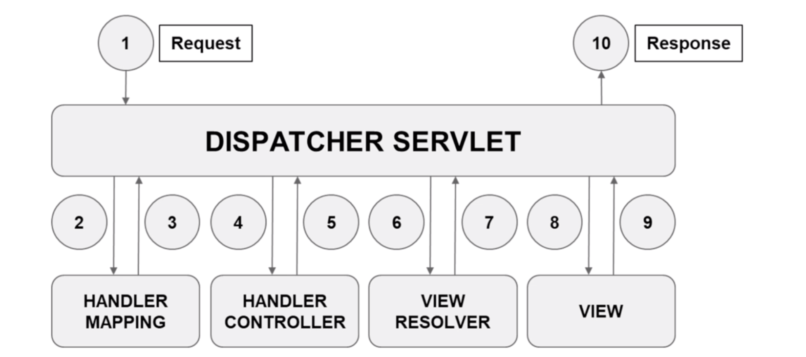

# Spring MVC

This repo contains the initial info of creating Spring MVC project.

The below diagram shows the flow of Spring MVC request processing.

Steps:

1. The browser creates a request for a specific url. `Dispatcher Servlet` acts as front controller to receive all requests
2. The `Dispatcher Servlet` needs to identify which controller to handle the requests. So it uses `handler mapping`
3. `handler mapping` returns the specific handler method that handles the request
4. `Dispatcher Servlet` calls the specific handler method
5. The handler method returns the model and view name
6. The `Dispatcher Servlet` now has the logical view name
7. After the `View Resolver` receives the view name, it needs to find the **jsp** file in the WEB-INF/view directory
8. The file name is returned to `Dispatcher Servlet` and `Dispatcher Servlet` executes it 
9. The view is rendered and content is given to `Dispatcher Servlet`
10. The `Dispatcher Servlet` gives the response back to browser
